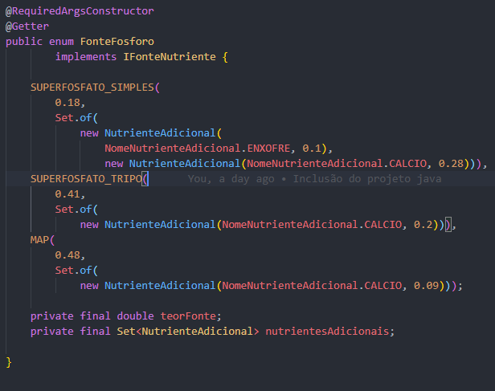

# DÚVIDA

Olá professor tenho uma dúvida em relação a Correção de Fósforo.
A planilha contém 12 fontes de fósforo, porém no arquivo FonteFosforo.java existem somente 3 fontes.
Devo implementar as fontes faltantes ou trabalhar com oque está pronto no projeto java?

## Projeto

Para instruções de como rodar cada projeto verificar README na pasta soil-correction(GUI) e soilcorrectionrest(API)
