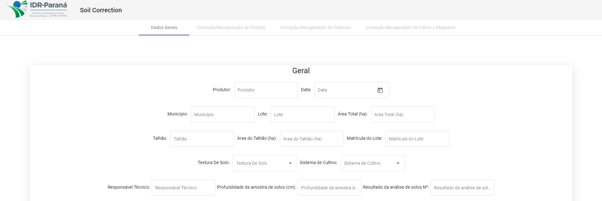
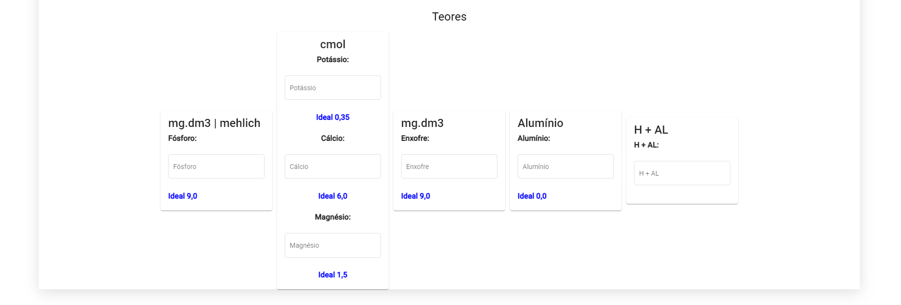
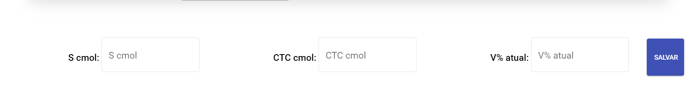

# Soil Correction GUI

Elaboração de uma interface gráfica para o projeto [Soil Correction](https://github.com/gabrielcostasilva/sa-soilcorrection) da disciplina de Arquitetura de Software UTFPR.

## Visão Geral
A interface gráfica foi feita utilizando o Angular Framework.

O projeto segue as boas práticas apresentadas no [styleguide](https://angular.io/guide/styleguide#folders-by-feature-structure) do Angular Framework.

Estrutura de pastas baseada no folders-by-feature do [styleguide](https://angular.io/guide/styleguide#folders-by-feature-structure) do Angular Framework.

Padrão do código mantido através do [Angular ESLint](https://github.com/angular-eslint/angular-eslint).

## Tela Principal

No momento a tela principal possui uma barra no topo com um logo do IDR-PR e o nome do projeto. Possuí também navegação para a função de correção de solo.

## Correção de Solo



A tela de correção de solo possui o formulário de dados gerais e o formulário de teores. Também foram separados entre guias as possíveis novas telas.
Ao selecionar a textura de solo, os valores ideais para os teores serão preenchidos.
Botão Salvar é flutuante.
Ao preencher os dados e clicar no botão salvar, a tela irá rolar até os resultados de S cmol, CTC cmol e V% atual nos quais serão preenchidos com valores falsos.


## Iniciar Projeto

Vá ao diretório do projeto.

```bash
cd soil-correction
```

Instale as dependências.

```bash
npm install
```

Inicie o projeto.
```bash
npm start
```