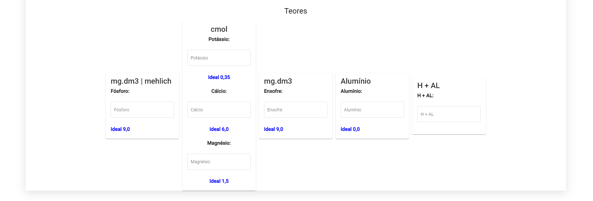

## Soil Correction GUI

Elaboração de uma interface gráfica para o projeto [Soil Correction](https://github.com/gabrielcostasilva/sa-soilcorrection) da disciplina de Arquitetura de Software UTFPR.

## Visão Geral

A interface gráfica foi feita utilizando o Angular Framework.

O projeto segue as boas práticas apresentadas no [styleguide](https://angular.io/guide/styleguide) do Angular Framework.

Estrutura de pastas baseada no folders-by-feature do [styleguide](https://angular.io/guide/styleguide#folders-by-feature-structure) do Angular Framework.

Padrão do código mantido através do [Angular ESLint](https://github.com/angular-eslint/angular-eslint).

## Tela Principal


No momento a tela principal possui uma barra no topo com um logo do IDR-PR e o nome do projeto. Possuí também navegação para a função de correção de solo.

## Correção de Solo




A tela de correção de solo possui o componente de dados gerais. Também foram separados entre guias as telas de correção, que só serao habilitadas caso a correção de solo seja feita.
Ao selecionar a textura de solo, os valores ideais para os teores serão preenchidos.
Botão Salvar é flutuante.
Ao preencher os dados e clicar no botão salvar, a tela irá rolar até os resultados de S cmol, CTC cmol e V% atual, MO% e Carbono nos quais serão preenchidos com os valores do cálculo CTC.

## Correção/Recuperação de Fósforo


O componente de Correção/Recuperação de Fósforo possúi um formulário para a seleção de Teor de Fósforo a atingir, a Fonte de Fósforo, o custo da fonte e a eficiência do fósforo.
Ao clicar no botão corrigir serão preenchidos com dados da correção de fósforo os campos: Quantidade a aplicar, Custo - R$/ha, "Essa correção de FÓSFORO, fornecerá também (kg/ha):"

## Correção/Recuperação de Potássio


O componente de Correção/Recuperação de Potássio possúi um campo "Participação atual do POTÁSSIO na CTC do solo:" com um valor real presente na CTC, um formulário para informar a participação desejada de Potássio na CTC, a Fonte de Potássio e o custo da fonte.
Ao clicar no bottão corrigir serão preenchidos com dados da correção de potássio os campos: Quantidade a aplicar, Custo - R$/ha.

## Correção/Recuperação de Cálcio e Magnésio


O componente de Correção/Recuperação de Cálcio e Magnésio possúi dois "cards", um para Cálcio e outro para Magnésio. O de cálcio possúi 3 campos: Participação atual na CTC do solo com valor real presente na CTC, Após Correções, % de participação do CÁLCIO na CTC, desejada. Já o de magnésio possui: Participação atual na CTC do solo com valor real presente na CTC e Após as correções.
O componente também possui os seguintes campos a preencher: Fonte de Corretivo a usar, Custo da Fonte, PRNT, Teor de CaO do corretivo.
Ao clicar no bottão corrigir serão preenchidos com dados da correção de Cálcio e Magnésio os campos: Após correção dos dois cards, Quantidade a aplicar, Custo - R$/ha., V% Após Correções.

## Iniciar Projeto

Vá ao diretório do projeto.

```bash
cd soil-correction
```

Instale as dependências.

```bash
npm install
```

Inicie o projeto.

```bash
npm start
```

## Testes

Foram feitos testes de interface de todos os componentes utilizando o framework de testes Cypress.
Para rodar os testes siga as seguintes instruções

Caso não esteja no diretório do projeto.

```bash
cd soil-correction
```

Caso não foi executado npm install.

```bash
npm install
```

Rode os testes.

```bash
npm run test
```

Após isso os testes iniciarão no terminal, caso todos passem verá a seguinte tela no terminal:


Também serão gerados na pasta "cypress/videos" as gravações das execuções dos testes:


CASO NÃO FUNCIONAR:

Após o "npi i" execute:

Windows:

```bash
node_modules\.bin\cypress run
```

Linux:

```bash
node_modules/.bin/cypress run
```

Se isso também nao funcionar utilize:

Windows:

```bash
node_modules\.bin\cypress cache clear
```

```bash
node_modules\.bin\cypress install --force
```

```bash
node_modules\.bin\cypress run
```

Linux:

```bash
node_modules/.bin/cypress cache clear
```

```bash
node_modules/.bin/cypress install --force
```

```bash
node_modules/.bin/cypress run
```
