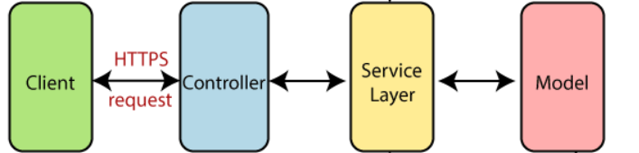
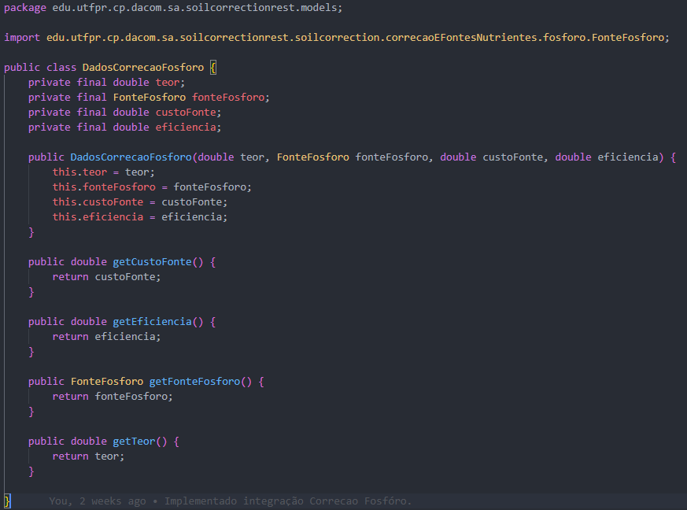
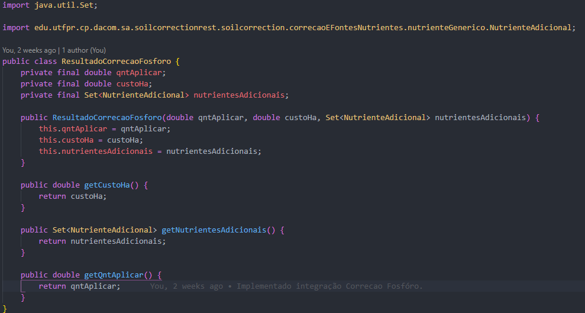
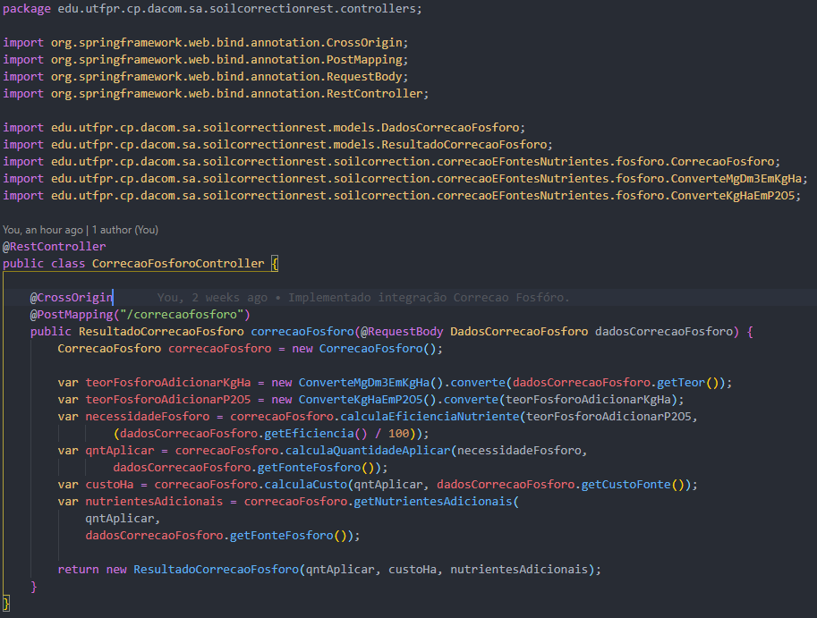

# Por quê Spring Boot?

- Um dos frameworks mais conhecidos.

- O Spring Boot tem uma boa documentação.

- Tem uma comunidade vasta, facilitando a busca de informações.

- Spring initializr facilita a criação de um projeto, além de facilitar a adição de dependências.

## Estruturação do Projeto

Foi utilizada a arquitetura Spring Boot Flow, o cliente realiza requisições HTTP para controllers que esperam requisições especificas, as controllers mapeam os requests e chamam a camada de serviço(soilcorrection), a camada de serviço realiza toda a lógica de negócio e mapeam os resultados através das classes presentes em Model.


As classes foram separadas entre os pacotes models, controllers e soilcorrection.

## Models

Aqui são mapeadas as estruturas de entrada e respostas. No qual Dados'funcionalidade' mapeia o body de um request http e Resultado'funcionalidade'mapeia o JSON de resposta.
Exemplos:



## Controllers

Cada controller "escuta" em uma determinada url(/correcaofosforo) e um determinado request(POST). Recebendo um body baseado na estrutura criada nas models e retornando um JSON estruturado nas models. A controller instância as classes que realizam a lógica de negócios, realizando todas os cálculos de correção de solo necessários.
Exemplos:


## Iniciar Projeto

Rode o seguinte comando no terminal, estando no diretório soilcorrectionrest.

```bash
mvnw spring-boot:run
```
